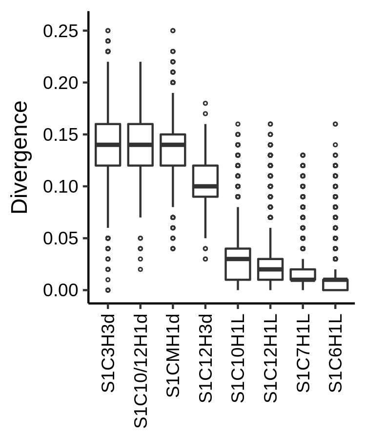

# Divergence of selected SF1 HORs

Here are the scripts and a step-by-step description of the data preparation process and
the calculation of the divergence for the monomers obtained from the [custom track](../track)
of the UCSC Genome Browser.

This is an example of commands that can be used to process sequences from one region
of hg38 assembly [chr6:58692241-59617260](https://genome.ucsc.edu/cgi-bin/hgTracks?db=hg38&position=chr6%3A58692241-59617260).

1. Currently manual operation. In UCSC Table Browser: choose __group__ Custom Track
and __track__ HMMER SF1 HORs t281 and set filter for specific __name__ (in this example `S1C6H1L*`) and
lenght __(chromEnd - chromStart)__ >= 150, and __output format__ as sequence to file
(in this example __output file__ is named `GJ211907.1-chr6-58692241-59617260.fasta`),
with following __Sequence Retrieval Options__: CDS, One FASTA record per region
with 1 extra base upstream and 0 downstream. __Sequence Formatting Options__: All upper case.

2. Correct FASTA names after export sequences from UCSC Genome Browser
```bash
awk -F"_" '{gsub(/hg38|range=| 5.+$/,"");print $1 $5}' ./GJ211907.1-chr6-58692241-59617260.fasta > ./GJ211907.1-chr6-58692241-59617260-ed1.fasta
```

3. From multiline to one line
```bash
awk 'NR==1&&/^>/{printf("%s\n",$0)}NR>1&&/^>/{printf("\n%s\n",$0)}!/^>/{printf("%s",$0)}END{printf"\n"}' ./GJ211907.1-chr6-58692241-59617260-ed1.fasta > ./GJ211907.1-chr6-58692241-59617260-ed2.fasta
```

4. Sort FASTA by name (_NOTE: BED file exported from UCSC Table Browser are not sorted!_)
```bash
cat ./GJ211907.1-chr6-58692241-59617260-ed2.fasta | awk '/^>/{n=1;for(i=1;i<=NF;i++){printf("%s ",$i);if(i==NF)printf"\t"}}n&&!/[^ACGTN-]/{print;n=0}' | sort -k2V - | sed -e 's/ \t/\n/' > ./GJ211907.1-chr6-58692241-59617260-ed2-sorted.fasta
```

5. Split FASTA seq to files by name
```bash
for filename in $(find . -name "*-[0-9].fasta"); do dir_name=$(dirname "$filename"); awk '/^>/{n=1;for(i=1;i<=NF;i++){printf("%s ",$i);if(i==NF)printf"\t"}}n&&!/[^ACGTN\-]/{print;n=0}' "$filename" | awk '{n=substr($1,2);gsub(/\//,"_",n);sub(/\t/,"\n");print>>"'$dir_name'/"n".fas"}'; done
```

6. Remove extra files
```bash
find . \( -name "S1*.fas" ! -name "S1C6*.fas" -o -name "S1*.*_*.fas" \) -delete
```

7. Count FASTA sequences
```bash
find . -name "S1*.fas" -exec awk '/^>/{n++}END{print FILENAME,n}' {} >> seq-count.txt \;
```

8. Make alignment
`./align.sh` — in this [script](align.sh) we use [MEGACC](https://www.megasoftware.net/) with [MEGACC analysis options files](../MEGACC-analysis-options-files/).
All alignments are placed in the [alignments folder](alignments/).

9. Calculate divergence rate with [Divergence rate script](https://github.com/enigene/Divergence-rate)
```bash
find . -name "S1*-aln.fas" -exec sh -c 'awk -v rules=ggs -f "~/git/enigene/Divergence-rate/divergr.awk" {} > $(dirname {})/$(basename {} .fas)-divgr.txt' \;
```

10. Create new file starting with line
```bash
echo -e "HORname\tDivergence" > SF1-HOR-divergence-rate.tsv
```

11. Gather stats and format file as tsv
```bash
find . -name "*-divgr.txt" -exec sh -c 'awk "\$1~/^[0-9]+$/{num=\$1;name=\$2;div=\$3;printf(\"%s\t%.2f\n\",name,div)}" {} >> ./SF1-HOR-divergence-rate.tsv' \;
```

12. Remove text with underscores
```bash
sed -i'' -e 's/_.*_//' ./SF1-HOR-divergence-rate.tsv
```

13. Get plot with this [script](divgr-boxplot.R)
The input file with the divergence data that is used in this script is presented in a
compressed form, because of its large size [SF1-HOR-divergence-rate.tsv](SF1-HOR-divergence-rate.tsv.gz).
```bash
Rscript ./divgr-boxplot.R
```



Table with the values of the geom_boxplot object used when creating the image:

ymin|lower|middle|upper|ymax|        notchupper|         notchlower|ymin_final|ymax_final|HORnames
----|-----|------|-----|----|------------------|-------------------|----------|----------|--------
0.07| 0.12|  0.14| 0.16|0.22| 0.141624254732057|  0.138375745267943|      0.02|      0.22|S1C10/12H1d
0.06| 0.12|  0.14| 0.16|0.22| 0.140186921720317|  0.139813078279683|         0|      0.26|S1C3H3d
0.08| 0.12|  0.14| 0.15|0.19| 0.140785000637641|  0.139214999362359|      0.04|      0.25|S1CMH1d
0.05| 0.09|   0.1| 0.12|0.16| 0.102017477977898| 0.0979825220221018|      0.03|      0.18|S1C12H3d
   0| 0.01|  0.03| 0.04|0.08|0.0300318658792582| 0.0299681341207418|         0|      0.16|S1C10H1L
   0| 0.01|  0.02| 0.03|0.06|0.0200368469588141| 0.0199631530411859|         0|      0.16|S1C12H1L
   0|    0|  0.01| 0.01|0.02|0.0100123382162136|0.00998766178378644|         0|      0.16|S1C6H1L
   0| 0.01|  0.01| 0.02|0.03|0.0100213101019785|0.00997868989802149|         0|      0.13|S1C7H1L
